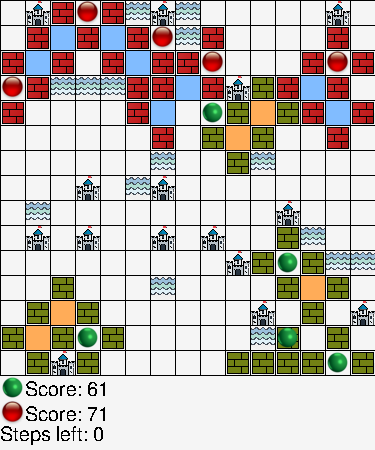

#  ✨ Castle AI ✨  

Documents link: https://www.fit.uet.vnu.edu.vn/wp-content/uploads/2023/04/De-PROCON_2023.pdf

## Install Python Libraries and Packages
``` bash
pip install -e .
```
`Note:` Using virtual environment (conda) is recommended to ensure the packages are installed in the right environment.
## Run script using random steps for testing

``` bash
usage: random_step_test.py [-h] [--render]

options:
  -h, --help  show this help message and exit
  --render    Whether to render the game
```

Example command for testing game with 10 episodes:

```python
python3 test_game.py --render
```



